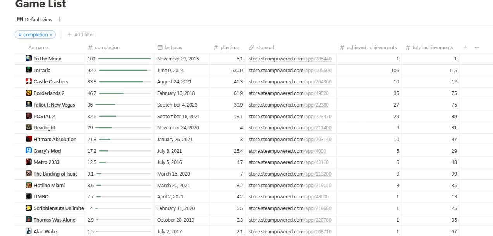

# 🎮 Notion Steam 游戏列表

🌐 **语言**: [English](./README_en.md) / [中文](./README.md)

效果参考：https://colorfulblog.notion.site/Game-OS-e48032dd37d747149bef346b2b823900

---


2025.5.27更新：加入了游戏简介和tags，现在会从steam商店爬取游戏简介和tags。之前的action项目会无法运行，需要在数据库中加入info（文本）和tags（Multi-select）字段。

2025.5.11更新：加入了steam评测抓取的功能，现在会抓取steam用户的评测到steam数据库中。之前的action项目会无法运行，需要在数据库中加入review（文本）字段。

## 📖 描述

该项目允许您通过 Steam API 将指定用户的 Steam 公开游戏库数据导入到指定的 Notion 数据库中。此外，您还可以通过 **GitHub Actions** 实现数据库的自动更新。

在 Notion 中的表格格式如下所示：



### 📊 导入的数据字段：

| 字段名称         | 数据类型 |
| ---------------- | -------- |
| 🎮 游戏名称      | `title`  |
| ⏱️ 游玩时长 (h)  | `number` |
| 📅 上次游玩时间  | `date`   |
| 🔗 商店链接      | `url`    |
| 🖼️ 游戏 Logo     | `image`  |
| 🖼️ 游戏封面      | `image`  |
| ✅ 完成度        | `number` |
| 🏆 已完成成就数  | `number` |
| 🏅 总成就数      | `number` |
| ✍️ 评测      | `text` |
| 📟 游戏简介      | `text` |
| 🎨 游戏标签      | `multi-select` |


---

## 🚀 使用 GitHub Actions 实现自动化

### 1️⃣ **Fork 此仓库**

点击仓库页面上的 **Fork** 按钮：


---

### 2️⃣ **创建包含以下字段的 Notion 数据库**

确保您的 Notion 数据库包含以下字段：

| 字段名称               | 数据类型 |
| ---------------------- | -------- |
| `name`                | `title`  |
| `playtime`            | `number` |
| `last play`           | `date`   |
| `store url`           | `url`    |
| `completion`          | `number` |
| `achieved achievements` | `number` |
| `total achievements`  | `number` |
| `review`  | `text` |
| `tags`  | `multi-select` |
| `info`  | `text` |


---

### 3️⃣ **配置 GitHub Actions 所需变量**

GitHub Actions 需要以下变量进行配置：

```yaml
env:
  STEAM_API_KEY: ${{ secrets.STEAM_API_KEY }}
  # 从 https://steamcommunity.com/dev/apikey 获取
  STEAM_USER_ID: ${{ secrets.STEAM_USER_ID }}
  # 从您的 Steam 个人资料获取：https://steamcommunity.com/profiles/{STEAM_USER_ID}
  NOTION_API_KEY: ${{ secrets.NOTION_API_KEY }}
  # https://developers.notion.com/docs/create-a-notion-integration
  NOTION_DATABASE_ID: ${{ secrets.NOTION_DATABASE_ID }}
  # https://developers.notion.com/reference/retrieve-a-database
  include_played_free_games: ${{ secrets.include_played_free_games }}
  # 默认设置为 'true'
  enable_item_update: ${{ secrets.enable_item_update }}
  # 默认设置为 'true'
  enable_filter: ${{ secrets.enable_filter }}
  # 默认设置为 'false'
```

| 变量名称                  | 数据类型 | 描述                           |
| ------------------------- | -------- | ------------------------------ |
| `STEAM_API_KEY`           | `string` | Steam API 密钥                 |
| `STEAM_USER_ID`           | `string` | Steam 用户 ID                  |
| `NOTION_API_KEY`          | `string` | Notion API 密钥                |
| `NOTION_DATABASE_ID`      | `string` | Notion 数据库 ID               |
| `include_played_free_games` | `string` | 是否包含免费游戏（`'true'/'false'`，需加引号） |
| `enable_item_update`      | `string` | 是否启用项目更新（`'true'/'false'`） |
| `enable_filter`           | `string` | 是否启用过滤器（`true/false`） |

💡 **注意**: 在您 Fork 的仓库中，进入 `Settings -> Secrets and Variables -> Actions -> New repository secret` 添加以上变量。


---

### 4️⃣ **完成！**

配置完成后，GitHub Actions 将每天在 **12:00 UTC** 自动更新您的 Notion 数据库。您也可以通过以下路径手动触发工作流：

**Actions -> Update Notion with Steam Data -> Run workflow**


---

## 🖥️ 本地部署

### 1️⃣ **修改配置参数**

在 `main.py` 中更新配置参数：

```python
# CONFIG
STEAM_API_KEY = os.environ.get("STEAM_API_KEY")
STEAM_USER_ID = os.environ.get("STEAM_USER_ID")
NOTION_API_KEY = os.environ.get("NOTION_API_KEY")
NOTION_DATABASE_ID = "NOTION_DATABASE_ID"
# OPTIONAL
include_played_free_games = 'true'
enable_item_update = 'true'
enable_filter = 'false'
```

将占位符替换为您的密钥：

```python
# CONFIG
STEAM_API_KEY = 'your_steam_api_key'
STEAM_USER_ID = 'your_steam_user_id'
NOTION_API_KEY = 'your_notion_api_key'
NOTION_DATABASE_ID = 'your_notion_database_id'
# OPTIONAL
include_played_free_games = 'true'
enable_item_update = 'false'
enable_filter = 'true'
```

---

### 2️⃣ **安装所需库**

确保您已安装 Python 3.6+。如果未安装，请从 [Python 官网](http://www.python.org) 下载。

安装所需库：

```bash
pip install requests
```

---

### 3️⃣ **运行程序**

本地运行程序：

```bash
python main.py
```

---

## 🔑 配置详情

### 🔑 **STEAM_API_KEY**

从以下链接获取您的 Steam API 密钥：  
[Steam API 密钥注册](https://steamcommunity.com/dev/apikey)

---

### 🔑 **STEAM_USER_ID**

从您的个人资料链接中找到您的 Steam 用户 ID：  
`https://steamcommunity.com/profiles/{STEAM_USER_ID}`

---

### 🔑 **NOTION_API_KEY**

创建一个 Notion 集成并获取您的 API 密钥：  
[Notion 集成指南](https://developers.notion.com/docs/create-a-notion-integration)

---

### 🔑 **NOTION_DATABASE_ID**

通过复制数据库链接获取您的 Notion 数据库 ID：  
`https://www.notion.so/{workspace_name}/{database_id}?v={view_id}`

---

### 🔑 **可选参数**

- `include_played_free_games`: 是否包含免费游戏（`true/false`）
- `enable_item_update`: 是否启用项目更新（`true/false`）
- `enable_filter`: 是否启用过滤器（`true/false`）

---


## 🛠️ 故障排除

如果遇到问题，请确保：

1. 所有必需变量已正确设置。
2. 您的 Notion 数据库已正确配置并链接到您的集成。
3. 已安装 Python 和所需库。

---

🎉 **享受自动化您的 Notion Steam 游戏列表的乐趣吧！**
