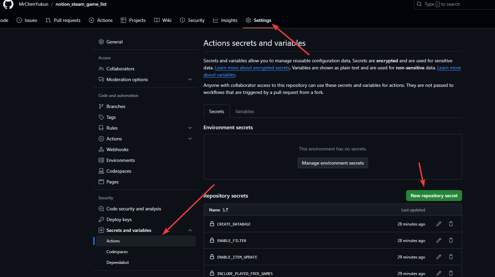

# notion_steam_game_list

Language: English/[中文](./README_zh_cn.md)

## description

this project use notion integration to imported a steam user's game library to notion database via steam api and notion api.

You can also automated this workflow with GithubAction to daily up your notion pages!

the resultis as follows:


import these data：

| name                        | type   |
| --------------------------- | ------ |
| name                        | title  |
| playtime(h)                 | number |
| last play                   | date   |
| store url                   | url    |
| game logo                   | image  |
| game cover                  | image  |
| completion                  | number |
| achieved achievements count | number |
| total achievements count    | number |

## Automated with Github Action

### Fot this repository

click fork.


### Configure variables

github action workflowed used these variables.

```yaml
        env:
          STEAM_API_KEY: ${{ secrets.STEAM_API_KEY }}
          STEAM_USER_ID: ${{ secrets.STEAM_USER_ID }}
          NOTION_DATABASE_API_KEY: ${{ secrets.NOTION_API_KEY }}
          NOTION_DATABASE_ID: ${{ secrets.NOTION_DATABASE_ID }}
          #OPTIONAL
          include_played_free_games: ${{secrets.include_played_free_games}}
          enable_item_update: ${{secrets.enable_item_update}}
          enable_filter: ${{secrets.enable_filter}}
          CREATE_DATABASE: ${{secrets.CREATE_DATABASE}}
          PAGE_ID: ${{ secrets.PAGE_ID }}
```

| name                      | type   | description                                                                                 |
| ------------------------- | ------ | ------------------------------------------------------------------------------------------- |
| STEAM_API_KEY             | string | steam api key                                                                               |
| STEAM_USER_ID             | string | steam user id you want fetch data from                                                      |
| NOTION_DATABASE_API_KEY   | string | notion api key                                                                              |
| NOTION_DATABASE_ID        | string | the notion data base id you wanted to imported                                              |
| include_played_free_games | string | whether to include free games                                                               |
| enable_item_update        | string | whether to include item update                                                              |
| enable_filter             | string | whether to include item filter                                                              |
| CREATE_DATABASE           | string | whether to create new database<br />（when set to 'true', ignore NOTION_DATABASE_ID）       |
| PAGE_ID                   | string | the page id you want to create database at<br />（applys when CREATE_DATABASE set to true） |

The detailed of these variables and what they do are at next chpter (deployed local -> modify config)

open the repository you just forked, press settings->Secrets and Variables->Actions->New repository screct，add these variables. note that  bool variable should be set to 'true' or 'false'



### Done！

This should work now! I set github action to run daily at 12am UTC time, you can change that at main.yml. If you want to trigger mannually, click Actions->Update Notion with Steam Data->Run workflow！


## Deploy Locally

### modify config

Modify configuration in main.py, the configurations are as follows:

```python
# CONFIG
STEAM_API_KEY = os.environ.get("STEAM_API_KEY")
STEAM_USER_ID = os.environ.get("STEAM_USER_ID")
NOTION_DATABASE_API_KEY = os.environ.get("NOTION_DATABASE_API_KEY")
NOTION_DATABASE_ID = "REDACTED_NOTION_DATABASE_ID"
# OPTIONAL
include_played_free_games = True
enable_item_update = False
enable_filter = True
# related to is_record() function to not record some games based on certain rules
CREATE_DATABASE = False
PAGE_ID = "a6c344eee16c46909f7525601282cdbb"
```

You should replace these config with your own api keys.

After Modified the configuration should looks like this:

```python
# CONFIG
STEAM_API_KEY = 'xxxx'
STEAM_USER_ID = 'xxxx'
NOTION_DATABASE_API_KEY = 'xxxx'
NOTION_DATABASE_ID = "xxxx"
# OPTIONAL
include_played_free_games = 'true'
enable_item_update = 'false'
enable_filter = 'true'
CREATE_DATABASE = 'false'
PAGE_ID = "xxxx'
```

#### STEAM_API_KEY

You can get it from https://steamcommunity.com/dev/apikey

#### STEAM_USER_ID

The steam user you want to get steam game library data from, The user is could get from steam profile permanent link, the link looks like this:

[https://steamcommunity.com/profiles/{STEAM_USER_ID}](https://steamcommunity.com/profiles/%7BSTEAM_USER_ID%7D)

#### NOTION_DATABASE_API_KEY

NOTION integration apikey，you should create a intergration, and create a connection at the page where your database at.

follows the instruction as notion develop documents shows in "getting start" chapter[Build your first integration (notion.com)](https://developers.notion.com/docs/create-a-notion-integration)

This “API secret”  the document refer to  is NOTION_DATABASE_API_KEY。

#### NOTION_DATABASE_ID

the database you want to import to's id, before import you should make sure this database's page is added to connection with the itergration you created.

the database should contains these item with exact name and data type as the bracket shows.

- name(title)
- playtime(number)
- last play(date)
- store url(url)

the database id could get from its share link.

open the database as a full page, and click share->copy link, this link's format is as follows:

[https://www.notion.so/{workspacename}/{database_id}?v={viewID}](https://www.notion.so/%7Bworkspacename%7D/%7Bdatabase_id%7D?v=%7BviewID%7D)

this {database_id} is the database id.

The program also provide a CREATE_DATABASE configuration to create a database and import data to that created database.

configure CREATE_DATABASE to True and the program will ignore {NOTION_DATABASE_ID} and created a database at {PAGE_ID}, and import data to that database.

#### include_played_free_games（OPTIONAL）

whether to include free games.

#### enable_item_update（OPTIONAL）

when set to True, the program will updated repeated item in database.

when set to False, the program will skip repeated item in database.

#### enable_filter（OPTIONAL）

whether to use is_record() function to filter added game. you could modified on your own.

#### CREATE_DATABASE（OPTIONAL）

whether to create new database, to use this you need to configure {PAGE_ID}.

CREATE_DATABASE to True and the program will ignore {NOTION_DATABASE_ID} and created a database at {PAGE_ID}, and import data to that database.

#### PAGE_ID（OPTIONAL）

when CREATE_DATABASE is set to False this configuration would be ignored.

to get page id is similar with database id. Open the page you want to created database to as full page, click share->copy link, the link's format is as follows:

[https://www.notion.so/{WORKSPACE}/{PAGE_TITLE}-{PAGE_ID}](https://www.notion.so/%7BWORKSPACE%7D/%7BPAGE_TITLE%7D-%7BPAGE_ID%7D)

the PAGE_ID is after the symbol '-'.

### install requests library

assume you have already installed python environment.

if not install python 3.6+ at www.python.org

```shell
pip install requests
```

### run the program

```
python main.py
```
